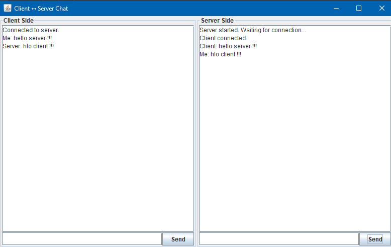

 
==================================================
     Java Swing Client-Server Chat Application
==================================================

 
## 📸 Preview

DESCRIPTION:
------------
This project is a simulation of a real-time chat system where both the client and server functionalities run in the same Java Swing window. It demonstrates basic networking using Java Sockets and GUI interaction using Java Swing components.

FEATURES:
---------
✅ Single window with two separate panels:
   - Left Panel: Client
   - Right Panel: Server

✅ Real-time message sending and receiving between simulated client and server.

✅ GUI built using Java Swing:
   - JTextArea for displaying chat
   - JTextField for input
   - JButton for sending messages

✅ Threads for handling input/output concurrently without freezing the UI.

HOW IT WORKS:
-------------
- A `ServerSocket` is created that listens on port 7777.
- A `Socket` connects to this port as a client from localhost.
- Two-way communication is established using:
   > BufferedReader and PrintWriter

- Separate threads handle:
   - Client reading messages from the server
   - Server reading messages from the client

- Messages typed in one panel are sent to the other side and displayed in respective areas.

REQUIREMENTS:
-------------
✔ Java Development Kit (JDK) 8 or above
✔ Basic understanding of Java networking and GUI

FILES:
------
✔ DualChatApp.java   → Main source code with complete GUI and networking logic

HOW TO COMPILE:
---------------
1. Open terminal/command prompt.
2. Navigate to the project directory.
3. Compile the Java file:
   javac DualChatApp.java

HOW TO RUN:
-----------
Run the compiled file:
   java DualChatApp

This will open a single window with two sections: Client and Server.

USAGE:
------
1. Type a message in the **Client input field** and press **Send** to send a message to the Server.
2. Type a message in the **Server input field** and press **Send** to send a message to the Client.
3. The message will appear in both chat areas with proper prefixes.

EXTENSIONS (Optional Ideas):
----------------------------
🔹 Add multiple clients (requires server thread pooling).
🔹 Show timestamps with messages.
🔹 Add file transfer feature.
🔹 Save chat history to a file.
🔹 Improve UI with modern design using JavaFX or look-and-feel libraries.

 

==================================================
